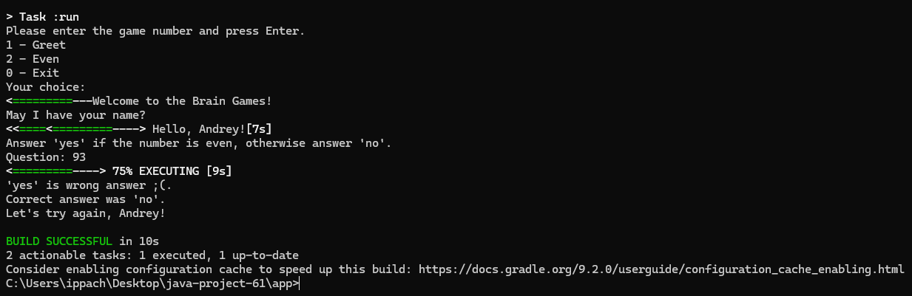
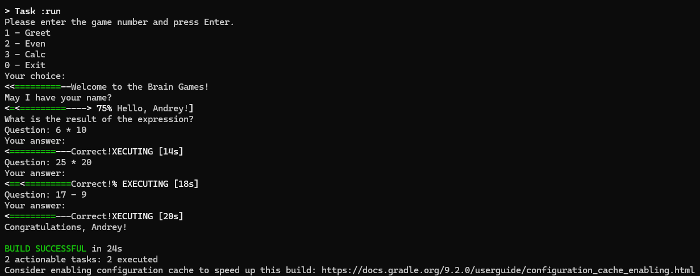
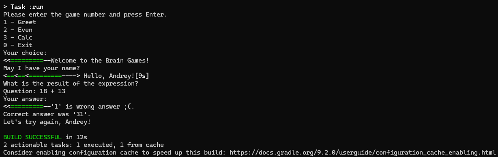
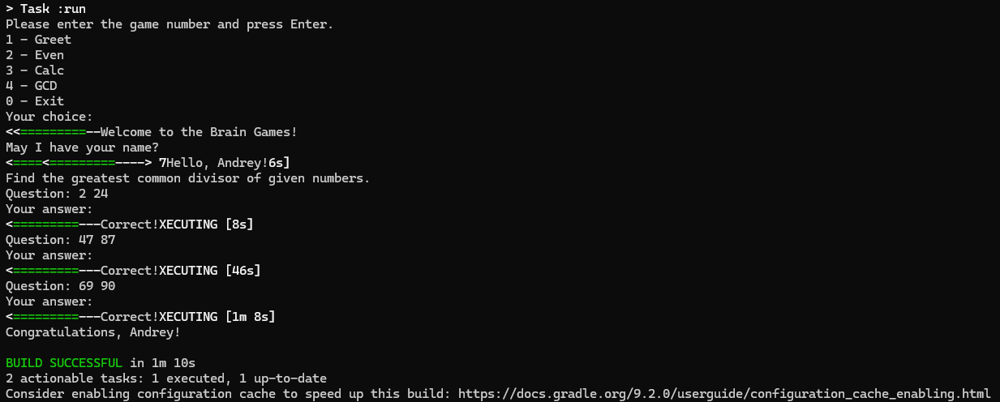
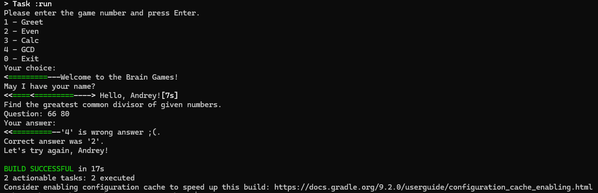

### Hexlet tests and linter status:
[](https://github.com/askirya/java-project-61/actions)

### SonarCloud Quality:
[](https://sonarcloud.io/dashboard?id=askirya_java-project-61)
[](https://sonarcloud.io/dashboard?id=askirya_java-project-61)
[](https://sonarcloud.io/dashboard?id=askirya_java-project-61)
[](https://sonarcloud.io/dashboard?id=askirya_java-project-61)
[](https://sonarcloud.io/dashboard?id=askirya_java-project-61)
[](https://sonarcloud.io/dashboard?id=askirya_java-project-61)
[](https://sonarcloud.io/dashboard?id=askirya_java-project-61)

## Описание проекта

Brain Games на Java с CLI интерфейсом, Makefile, Gradle и SonarQube анализом.

## Запуск

```bash
make run-dist

## Демонстрация работы игры Even

Успешная игра (3 правильных ответа):


Поражение (неправильный ответ):


## Демонстрация работы игры Calc

Успешная игра (3 правильных ответа):


Поражение (неправильный ответ):


## Демонстрация работы игры GCD

Успешная игра (3 правильных ответа):


Поражение (неправильный ответ):


